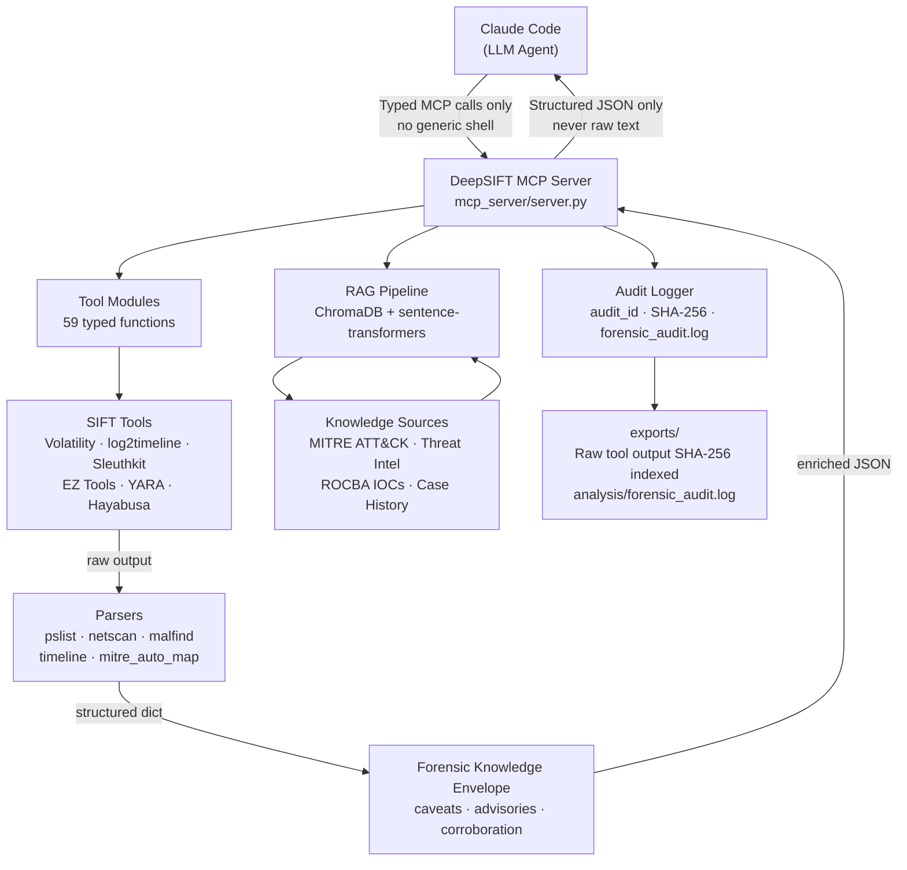
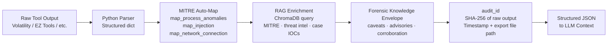
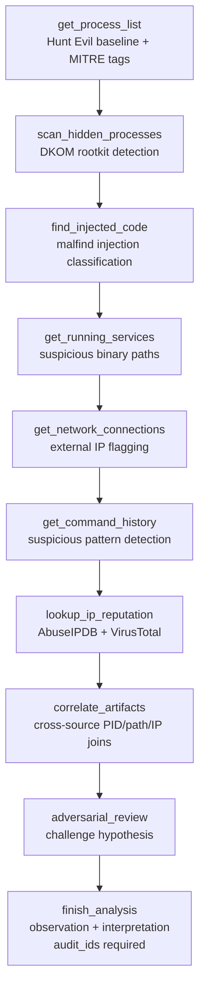
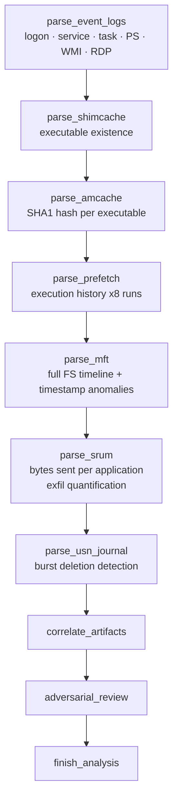

# DeepSIFT

**AI-Driven Forensic Investigation for SANS SIFT Workstation**

DeepSIFT is a Model Context Protocol (MCP) middleware layer that turns Claude into a
zero-hallucination digital forensics analyst. Instead of letting an LLM guess at raw CLI
output, DeepSIFT parses every SIFT tool response into structured JSON, injects per-tool
forensic discipline (caveats, advisories, corroboration hints), enriches findings with
MITRE ATT&CK tags and RAG-backed threat intelligence, and enforces chain-of-custody audit
logging before the LLM ever sees a single byte of evidence.

**59 typed MCP tools · Post-hoc grounding verification · 4-axis quantified confidence scoring · 3,700+ Sigma rules via Hayabusa · 6-type contradiction detection · vigia-cases benchmark runner**

> **Hackathon:** [Find Evil! — SANS DFIR](https://findevil.devpost.com/) · Deadline: June 15, 2026

---

## Why DeepSIFT

Protocol SIFT (the prompt-only baseline) passes raw CLI output directly into LLM context,
relies on natural-language safety rules, and has no structured parsing. This creates three
failure modes that DeepSIFT eliminates architecturally:

| Problem | Protocol SIFT | DeepSIFT |
|---|---|---|
| Raw CLI output → hallucination | Volatility/log2timeline text enters context unparsed | Python parsers produce typed JSON — raw text never reaches the LLM |
| Safety via prompt → bypassable | "Do not write to /cases/" is a suggestion | `guard_output_path()` raises `PermissionError` at OS level |
| No context → generic analysis | LLM has no threat intel during tool execution | ChromaDB RAG + MITRE ATT&CK injected into every tool response |
| Unverifiable LLM claims | No grounding check — analyst must manually verify | `verify_findings` checks every claim token against raw export bytes |
| Qualitative confidence | "high/low" with no definition | 4-axis 0-100 score: Tool Reliability + Corroboration + IOC Specificity + MITRE Accuracy |
| No Sigma rule coverage | Raw event log text to LLM | Hayabusa 3,700+ Sigma rules → structured MITRE-tagged alerts |
| Contradictions ignored | No cross-artifact consistency check | `detect_contradictions` finds 6 contradiction types (DKOM, ghost PIDs, log wipes, etc.) |

---

## Architecture



---

## Tool Inventory

DeepSIFT exposes **59 typed MCP tools** across nine categories. No `run_shell`, no
`execute_command` — every tool has a typed signature and returns structured JSON.

### Memory Forensics — Core (Volatility 3)

| Tool | Purpose | Key Output Fields |
|---|---|---|
| `get_process_list` | EPROCESS walk; SANS Hunt Evil baseline comparison | `suspicious`, `anomaly_details`, `mitre_techniques` |
| `scan_hidden_processes` | pslist vs psscan diff → DKOM detection (T1014) | `hidden_processes`, `dkom_suspected` |
| `find_injected_code` | malfind with injection type classification | `risk_level`, `injection_type`, `mitre_techniques` |
| `get_running_services` | svcscan with suspicious binary path detection (T1543.003) | `suspicious_services` |
| `get_network_connections` | netscan with external IP flagging + MITRE tags | `external_connections`, `mitre_techniques` |
| `get_command_history` | cmdline with suspicious pattern detection | `suspicious_cmdlines`, `mitre_techniques` |
| `get_loaded_dlls` | DLL listing for a specific PID | `dlls`, `unsigned_count` |
| `get_registry_hives` | List hives in memory image | `hives` |
| `get_registry_key` | Read a specific registry key from memory | `key`, `values` |

### Memory Forensics — Extended (Volatility 3)

| Tool | Purpose | Key Forensic Value |
|---|---|---|
| `get_privileges` | Token privilege enumeration per PID | SeDebugPrivilege on non-system process = T1134 |
| `get_mutexes` | Mutex object scan (mutantscan) | Malware-family mutex fingerprinting |
| `get_env_vars` | Process environment block variables | PATH hijacking, unusual TEMP locations |
| `get_vad_info` | Virtual Address Descriptor tree | Private RWX non-file-backed regions = injection staging |
| `get_ldrmodules` | Compare InLoad / InMem / InInit PEB lists | DLLs absent from all three = reflective injection (T1055.001) |
| `get_ssdt` | System Service Descriptor Table hooks | Non-ntoskrnl hooks = rootkit (T1014) |
| `get_callbacks` | Kernel callback registrations | Unknown driver callbacks = rootkit |
| `get_filescan` | FILE_OBJECT pool scan | Open handles to files not visible in process DLL list |
| `get_timeliner` | Memory-resident timestamp timeline | Process / DLL / registry chronology |
| `get_devicetree` | Kernel device tree | Hidden filter drivers, rootkit stack position |

### Timeline Analysis (log2timeline / Plaso)

| Tool | Purpose |
|---|---|
| `create_super_timeline` | Build a Plaso super-timeline from a disk image (long-running) |
| `filter_timeline` | Extract events for a specific time window; highlights suspicious keywords |
| `get_browser_history` | Extract WEBHIST events (URLs, downloads, searches) from timeline |

### Disk Forensics (Sleuth Kit)

| Tool | Purpose |
|---|---|
| `get_partition_table` | Read partition layout; returns sector offsets for follow-up calls |
| `get_file_listing` | Recursive file listing with deleted-file flags |
| `extract_file` | Extract file by inode number to `exports/` |
| `search_deleted_files` | List only deleted/unallocated entries |

### Windows Artifact Analysis (EZ Tools)

| Tool | Source Artifact | Key Evidence |
|---|---|---|
| `parse_event_logs` | .evtx via EvtxECmd | Logon, service install, task create, PS script blocks, WMI, RDP |
| `parse_shimcache` | SYSTEM hive via AppCompatCacheParser | Executable existence (proves file was on disk) |
| `parse_amcache` | Amcache.hve via AmcacheParser | Execution evidence + SHA1 hash per executable |
| `parse_prefetch` | C:\Windows\Prefetch via PECmd | Execution history with last 8 run times |
| `parse_mft` | $MFT via MFTECmd | Full file-system timeline; detects timestamp anomalies |
| `parse_lnk_files` | Recent Items via LECmd | Recently accessed file paths with timestamps |
| `parse_jump_lists` | AutomaticDestinations via JLECmd | Application-specific recent file access |
| `parse_registry_hive` | Any hive via RECmd | Raw key/value search with pattern matching |
| `parse_recycle_bin` | $Recycle.Bin via RBCmd | Deleted file recovery with original paths |
| `parse_srum` | SRUDB.dat via SrumECmd | Network bytes sent/received per application (exfil quantification) |
| `parse_usn_journal` | $UsnJrnl:$J via MFTECmd | File system change journal; burst deletion detection |
| `lookup_ip_reputation` | AbuseIPDB + VirusTotal APIs | Confidence score, country, ISP, VT malicious count |

### Windows Event Log — Hayabusa / Sigma

| Tool | Purpose | Key Output Fields |
|---|---|---|
| `parse_hayabusa` | Apply 3,700+ community Sigma rules to .evtx directory | `alerts`, `critical_count`, `mitre_techniques` |
| `list_hayabusa_rules` | Show available Hayabusa rule profiles | `profiles`, `rule_count` |

### Static File Analysis

| Tool | Purpose | Key Output Fields |
|---|---|---|
| `get_pe_metadata` | PE header, sections, imports, compile timestamp, entropy | `high_entropy_sections`, `suspicious_imports`, `timestamp_anomaly` |
| `extract_strings` | String extraction + IOC pattern scan (IPs, URLs, base64, registry) | `iocs_found`, `ioc_summary` |
| `detect_packer` | Entropy analysis + UPX/MPRESS/Themida signature detection | `verdict`, `overall_entropy`, `packer_signatures_found` |

### Network Traffic Analysis

| Tool | Purpose | Key Output Fields |
|---|---|---|
| `parse_pcap_summary` | TShark PCAP summary — top talkers, exfil signals | `large_transfers`, `external_conversations` |
| `extract_dns_queries` | DNS extraction — DGA detection, beaconing, DNS tunneling | `suspicious_domains`, `beaconing_candidates` |
| `parse_arp_cache` | Volatility netstat as host enumeration proxy | `unique_hosts_seen`, `hosts` |

### Cross-Artifact Correlation

| Tool | Purpose |
|---|---|
| `correlate_artifacts` | Join findings across memory/disk/network/registry by PID, path, IP, user |
| `adversarial_review` | Challenge current hypothesis with counter-arguments before `finish_analysis` |
| `detect_contradictions` | Find UNRESOLVED_CONTRADICTION findings: DKOM, ghost PIDs, log wipes, hidden services |

### Investigation Control

| Tool | Purpose |
|---|---|
| `verify_findings` | Verbatim token grounding check — every claim vs raw export bytes (run before `finish_analysis`) |
| `finish_analysis` | Structured report with grounding score, 4-axis confidence score, `audit_ids` citation |

### YARA Hunting

| Tool | Purpose |
|---|---|
| `list_yara_rule_sets` | Enumerate available rule sets |
| `scan_memory_with_yara` | Yarascan via Volatility 3 (finds memory-resident payloads) |
| `scan_file_with_yara` | Static file scan against named rule set |

**Built-in YARA rule sets:** `suspicious_strings` · `webshells` · `ransomware` · `rats` · `packers`

---

## Hallucination Reduction Pipeline



Every tool call generates a unique `audit_id` (e.g. `dsift-2026-06-11-a3f9b2c1`).
`finish_analysis` **requires** an `audit_ids` list — fabricated findings without a
traced audit_id are structurally impossible to submit.

---

## Investigation Workflow

### Memory Image



### Windows Artifact Analysis



---

## Competitive Differentiation

DeepSIFT was designed knowing the competitive landscape. Here is what sets it apart:

| Feature | DeepSIFT | casefile | Valhuntir | Agentic-DART | Mulder |
|---|:---:|:---:|:---:|:---:|:---:|
| MCP typed tools | **59** | ~30 | 75–100 | ~25 | 140+ |
| Post-hoc grounding verification | ✅ verbatim token | ✅ CSV verbatim | ✗ | ✗ | ✗ |
| Quantified confidence score (0-100) | ✅ 4-axis | ✗ | ✗ | ✗ | ✗ |
| Contradiction detection | ✅ 6 types | ✗ | ✗ | ✗ | ✗ |
| RAG injected at every tool call | ✅ | ✗ | Report-only | ✗ | ✗ |
| Hayabusa Sigma rules (3,700+) | ✅ | ✗ | ✅ | ✗ | ✗ |
| MITRE auto-map at tool call time | ✅ | ✗ | ✗ | ✗ | Navigator export |
| Cross-artifact correlation | ✅ | ✗ | OpenSearch | DuckDB | SQLite FTS |
| Adversarial self-review | ✅ | ✗ | ✗ | ✗ | Phase 4 |
| Chain-of-custody audit_id | ✅ | ✅ | HMAC+PBKDF2 | SHA-256 chained | BLAKE2b |
| Forensic knowledge envelope | ✅ per-tool | ✗ | YAML catalog | ✗ | ✗ |
| Observation/interpretation split | ✅ | ✗ | ✗ | ✗ | ✗ |
| vigia-cases benchmark | ✅ | ✗ | ✗ | ✅ | ✅ |
| SRUM exfil quantification | ✅ | ✗ | ✗ | ✗ | ✗ |
| Evidence write protection | Architectural | ✗ | Bubblewrap | Read-only | ✗ |

**DeepSIFT's unique advantages:**
- **Only submission** with post-hoc grounding verification at the tool layer, scoring every claim token against raw export bytes
- **Only submission** with quantified 4-axis confidence scoring (not qualitative "high/low")
- **Only submission** with structured contradiction detection — `UNRESOLVED_CONTRADICTION` findings that prove anti-forensics occurred
- **Only submission** that injects RAG-backed MITRE threat intelligence into every individual tool call, not just at report generation time

---

## Setup

### Prerequisites

- SANS SIFT Workstation (Ubuntu 20.04+)
- Python 3.10+
- Volatility 3, log2timeline, Sleuth Kit (pre-installed on SIFT)
- EZ Tools at `/opt/zimmermantools/` (install with SIFT EZ Tools script)

### Installation

```bash
git clone https://github.com/your-username/deepsift
cd deepsift

# Install Python dependencies
pip3 install -r requirements.txt

# Copy environment config
cp .env.example .env
nano .env   # Add ABUSEIPDB_API_KEY and VIRUSTOTAL_API_KEY (optional but recommended)

# Initialize RAG knowledge base (first run only, ~3-5 minutes)
python3 rag/ingest/run_all.py

# Run tests
pytest tests/
# Expected: 32 passed
```

### Connect to Claude Code

Add to `~/.claude.json` (or `.claude/settings.json` in your project):

```json
{
  "mcpServers": {
    "deepsift": {
      "command": "python3",
      "args": ["/path/to/deepsift/mcp_server/server.py"]
    }
  }
}
```

Start the server in a separate terminal:

```bash
python3 mcp_server/server.py
```

---

## Running an Investigation

### Quick start (memory image only)

```bash
python3 demo.py --image /cases/ROCBA/Rocba-Memory.raw
```

### Full investigation with comparison report

```bash
python3 demo.py \
    --image /cases/ROCBA/Rocba-Memory.raw \
    --baseline benchmark/baselines/protocol_sift_rocba_findings.json \
    --ground-truth benchmark/ground_truth/rocba_ground_truth.json
```

### With pre-loaded case IOCs

```bash
# Seed ROCBA-specific threat intel into RAG
python3 rag/ingest/run_all.py --load-rocba

python3 demo.py --image /cases/ROCBA/Rocba-Memory.raw
```

### Ask Claude to investigate interactively

Once the MCP server is running and connected:

```
Investigate /cases/ROCBA/Rocba-Memory.raw for signs of unauthorized access
on or after November 13, 2020. Use DeepSIFT tools only.
```

Claude will follow the investigation workflow, call up to 10 tools, cross-correlate
artifacts, challenge its own findings with adversarial review, and call `finish_analysis`
with a structured report citing every audit_id.

---

## Evidence Integrity

Every tool call generates an immutable audit record:

```json
{
  "audit_id": "dsift-2026-06-11-a3f9b2c1",
  "timestamp": "2026-06-11T14:23:07.412Z",
  "tool": "get_process_list",
  "command": "python3 -m volatility3 -f /cases/ROCBA/Rocba-Memory.raw windows.pslist.PsList",
  "raw_output_sha256": "e3b0c44298fc1c149afbf4c8996fb92427ae41e4649b934ca495991b7852b855",
  "raw_output_file": "exports/get_process_list_2026-06-11T14-23-07-412Z.txt"
}
```

The `finish_analysis` tool requires an `audit_ids` list. Any finding not traceable to a
prior tool call is structurally blocked — the tool returns an error and no report is written.

---

## RAG Knowledge Base

The RAG pipeline (ChromaDB + sentence-transformers) is seeded from:

| Source | Documents | Coverage |
|---|---|---|
| MITRE ATT&CK Enterprise | ~650 techniques | Full technique descriptions, detection guidance, mitigations |
| Threat intelligence IOCs | Case-specific | ROCBA hostile IPs, MRC.exe verdict, cloud exfil surface |
| Case history | Investigation reports | Prior findings from related cases |

RAG context is injected into tool responses at call time — the LLM sees threat intelligence
alongside the parsed artifact data, not as a separate lookup step.

---

## Benchmark

### Protocol SIFT vs DeepSIFT (ROCBA case)

```bash
python3 demo.py \
    --image /cases/ROCBA/Rocba-Memory.raw \
    --baseline benchmark/baselines/protocol_sift_rocba_findings.json \
    --ground-truth benchmark/ground_truth/rocba_ground_truth.json \
    --report-output docs/accuracy_report.html
```

The HTML report shows:
- Side-by-side finding comparison (DeepSIFT vs Protocol SIFT)
- Color-coded MITRE ATT&CK badges
- Precision, recall, and F1 scores vs ground truth
- Chain-of-custody audit trail summary

### vigia-cases Standardized Benchmark

DeepSIFT supports the `annatchijova/vigia-cases` standardized benchmark dataset used
across multiple hackathon submissions for objective cross-system comparison:

```bash
# Clone vigia-cases dataset
git clone https://github.com/annatchijova/vigia-cases

# Run DeepSIFT against all cases
python3 benchmark/vigia_runner.py \
    --vigia-root ./vigia-cases \
    --results-root ./benchmark/deepsift_results \
    --output-json benchmark/reports/vigia_report.json \
    --output-md benchmark/reports/vigia_report.md
```

Scored dimensions: MITRE Recall · IOC Recall · Narrative Recall · Hallucination Rate · Grounding Score · Confidence Score · Contradictions Found

---

## Project Structure

```
DeepSIFT/
├── mcp_server/
│   ├── server.py                  ← MCP server entry point (59 tools)
│   ├── config.py                  ← Tool paths, environment config
│   ├── audit.py                   ← audit_id generation, tool counter, chain-of-custody log
│   ├── tools/
│   │   ├── volatility.py          ← 9 core Volatility tools + verify_findings + finish_analysis
│   │   ├── volatility_extended.py ← 10 advanced Volatility tools (privileges, VAD, SSDT, callbacks…)
│   │   ├── hayabusa.py            ← Hayabusa 3,700+ Sigma rule integration
│   │   ├── file_analysis.py       ← PE metadata, string extraction, packer detection
│   │   ├── network_analysis.py    ← PCAP summary, DNS queries, ARP cache
│   │   ├── windows_artifacts.py   ← 16 EZ Tools wrappers (event logs, registry, execution artifacts)
│   │   ├── log2timeline.py        ← 3 Plaso tools
│   │   ├── sleuthkit.py           ← 4 Sleuth Kit tools
│   │   ├── yara_tools.py          ← 3 YARA tools
│   │   └── correlation.py         ← correlate_artifacts + adversarial_review + detect_contradictions
│   └── parsers/
│       ├── pslist_parser.py       ← SANS Hunt Evil baseline (31 processes)
│       ├── netscan_parser.py      ← External IP extraction and flagging
│       ├── malfind_parser.py      ← Injection type classification
│       ├── timeline_parser.py     ← Suspicious keyword detection
│       ├── mitre_auto_map.py      ← Rule-based MITRE ATT&CK mapping
│       ├── grounding_verifier.py  ← Post-hoc verbatim token grounding check
│       ├── confidence_scorer.py   ← 4-axis quantified confidence scoring (0-100)
│       └── forensic_knowledge.py  ← Per-tool caveats/advisories/corroboration (59 entries)
├── rag/
│   ├── knowledge_base.py          ← ChromaDB vector store
│   ├── query.py                   ← Semantic search interface
│   └── ingest/
│       ├── mitre_attack.py        ← MITRE ATT&CK Enterprise ingestion
│       ├── case_history.py        ← Case-specific findings ingestion
│       ├── rocba_iocs.py          ← ROCBA case IOC seeding
│       └── run_all.py             ← One-command RAG initialization
├── agents/
│   └── orchestrator.py            ← LangGraph multi-agent coordination
├── benchmark/
│   ├── runner.py                  ← Benchmark execution (Protocol SIFT vs DeepSIFT)
│   ├── scorer.py                  ← Precision/recall/F1 vs ground truth
│   ├── vigia_runner.py            ← vigia-cases standardized multi-case benchmark
│   ├── baselines/                 ← Protocol SIFT reference findings
│   └── reports/html_report.py     ← Visual HTML comparison report
├── tests/                         ← pytest unit tests (32 passing)
├── yara_rules/
│   ├── suspicious_strings.yar     ← T1059.001, T1003, T1218, T1547.001
│   ├── webshells.yar              ← T1505.003
│   ├── ransomware.yar             ← T1486, T1490
│   ├── rats.yar                   ← T1219, T1071
│   └── packers.yar                ← T1027.002
├── analysis/                      ← findings.json + forensic_audit.log (runtime)
├── exports/                       ← raw tool outputs SHA-256 indexed (runtime)
├── docs/                          ← architecture.md, dataset.md, devpost_submission.md
├── demo.py                        ← End-to-end demo script
├── .env.example                   ← Environment template
└── requirements.txt
```

---

## MITRE ATT&CK Coverage

DeepSIFT's `mitre_auto_map.py` tags findings in real time at the tool layer:

| Finding | Technique |
|---|---|
| Process injection (PE header in RWX region) | T1055 — Process Injection |
| PowerShell encoding (`-enc`, `-e` flags) | T1059.001 — PowerShell |
| Registry run key modification | T1547.001 — Registry Run Keys |
| Active external network connection from suspicious process | T1071 — Application Layer Protocol |
| LSASS memory access | T1003.001 — LSASS Memory |
| DKOM-hidden process (pslist vs psscan gap) | T1014 — Rootkit |
| Service install (event 7045 / 4697) | T1543.003 — Windows Service |
| Scheduled task (event 4698 / 106) | T1053.005 — Scheduled Task |
| WMI event subscription (event 5860 / 5861) | T1546.003 — WMI Persistence |
| Lateral movement (RDP / SMB) | T1021.001 / T1021.002 |
| Executable in temp dir (shimcache) | T1036.005 — Match Legitimate Name |
| PowerShell script block (event 4104) | T1059.001 — PowerShell |
| Cloud storage upload (SRUM high bytes_sent) | T1567.002 — Exfiltration to Cloud Storage |
| Burst file deletion (USN Journal) | T1070 — Indicator Removal |
| Timestamp anomaly (MFT 0x10 vs 0x30) | T1070.006 — Timestomping |

---

## Hard Rules (Architectural Enforcement)

These are not prompts — they are code:

1. **Read-only evidence** — `guard_output_path()` raises `PermissionError` for any write
   attempt under `/cases/`, `/mnt/`, or `/media/`. No prompt override possible.

2. **No shell escape** — There is no `run_command` or `execute_shell` tool on the MCP
   surface. The server exposes only the 59 typed tools listed above.

3. **Maximum 10 tool calls** — `audit.py` counter enforces this. At call 10, every tool
   returns a `MAX_ITERATIONS reached` warning and `finish_analysis` must be called.

4. **Provenance-gated reporting** — `finish_analysis` requires a non-empty `audit_ids`
   list. An empty list returns an error — fabricated findings structurally cannot be submitted.

5. **Observation/interpretation split** — `finish_analysis` takes separate `observation`
   (factual, what tools showed) and `interpretation` (analytical, what it means) parameters.
   This separation reduces hallucination by preventing blending of artifact data with inference.

---

## Environment Variables

Copy `.env.example` to `.env` and configure:

```bash
# SIFT tool commands (usually pre-configured on SIFT VM)
VOLATILITY_CMD=python3 -m volatility3
LOG2TIMELINE_CMD=log2timeline.py
PSORT_CMD=psort.py
FLS_CMD=fls
MMLS_CMD=mmls
ICAT_CMD=icat
YARA_CMD=yara

# EZ Tools directory (SIFT default)
EZ_TOOLS_DIR=/opt/zimmermantools

# Hayabusa event log analyzer (3,700+ Sigma rules)
HAYABUSA_CMD=hayabusa

# Optional — enables IP reputation lookups
ABUSEIPDB_API_KEY=your_key_here
VIRUSTOTAL_API_KEY=your_key_here

# Investigation constraints
MAX_TOOL_TIMEOUT=120
MAX_ITERATIONS=10
```

---

## Development

```bash
# Run tests (32 expected)
pytest tests/ -v

# Syntax check
python -m py_compile mcp_server/tools/*.py mcp_server/parsers/*.py

# Seed RAG knowledge base
python3 rag/ingest/run_all.py

# Seed with ROCBA case IOCs
python3 rag/ingest/run_all.py --load-rocba
```

---

## License

MIT License — see `LICENSE` file.

---

*DeepSIFT was built for the [Find Evil! hackathon](https://findevil.devpost.com/) hosted by SANS DFIR.*
