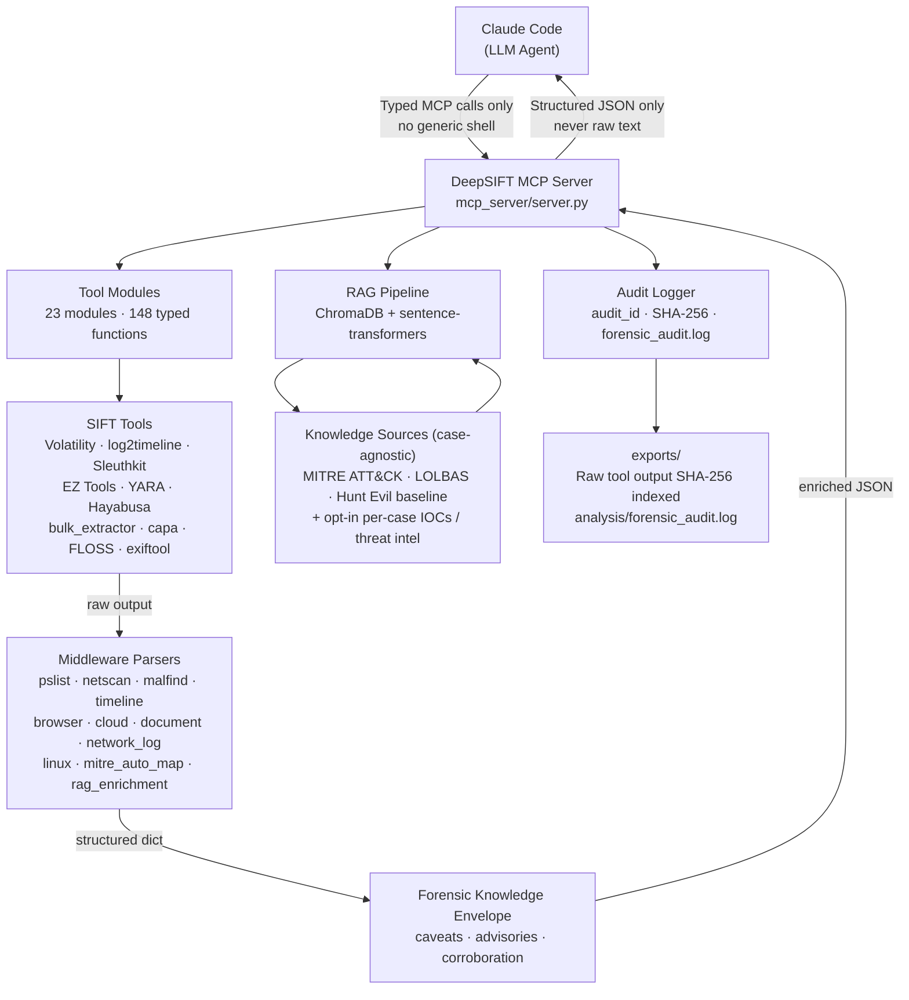
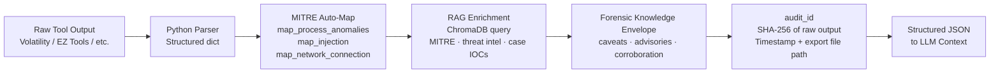
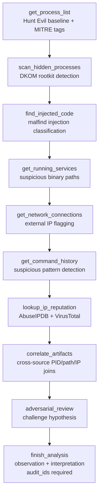
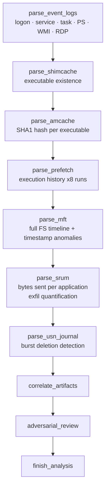

# DeepSIFT

**AI-Driven Forensic Investigation for SANS SIFT Workstation**

DeepSIFT is a Model Context Protocol (MCP) middleware layer that turns Claude into a
zero-hallucination digital forensics analyst. Instead of letting an LLM guess at raw CLI
output, DeepSIFT parses every SIFT tool response into structured JSON, injects per-tool
forensic discipline (caveats, advisories, corroboration hints), enriches findings with
MITRE ATT&CK tags and RAG-backed threat intelligence, and enforces chain-of-custody audit
logging before the LLM ever sees a single byte of evidence.

**148 typed forensic MCP tools (+ environment preflight self-check) · 23 tool modules · 15 parser modules · Per-tool RAG enrichment · Post-hoc grounding verification · 4-axis quantified confidence scoring · 3,700+ Sigma rules via Hayabusa · 6-type contradiction detection · case-agnostic benchmark runner · zero-dependency Examiner Portal**

> **Status:** Production-ready. Every tool executes a real forensic binary or parser —
> no simulated, demo-only, or placeholder analysis paths. All evidence paths are supplied
> per invocation (nothing is hard-coded to a specific image), each EZ Tools run clears its
> own output directory to prevent cross-case contamination, dirty registry hives are parsed
> as-acquired, and the RAG knowledge base ships case-agnostic (case IOCs are opt-in, never
> auto-loaded). Originally built for the [Find Evil! — SANS DFIR](https://findevil.devpost.com/)
> challenge.

---

### 🧑‍⚖️ For judges (and judging agents)

- **Start here:** [`AGENTS.md`](AGENTS.md) (agent orientation, entry points, 60-second run) and
  [`docs/JUDGING.md`](docs/JUDGING.md) (every Stage-2 criterion → exact code + how to verify).
- **Measured, not asserted:** ROCBA **4/4** and FOR500 "Abducted Zebrafish" **4/4** vs Protocol SIFT,
  **0 hallucinations, 100 % claim grounding** — scored by `benchmark/scorer.py` against published
  ground truth.
- **Don't trust the score — verify the evidence:** `python3 verify_findings.py` independently
  re-checks every claim against the cited raw tool output and recomputes the audit hash chain. The
  ground-truth files are *derived from the organizer case scenario* (see each file's `_provenance`),
  so trust rests on **reproducible grounding**, not our number.
- **Verify in minutes (no API key):** `python3 preflight.py` · `pytest -q` (74 pass) ·
  `python3 examiner_portal.py` (review UI + live audit-chain integrity).
- **Drive it as an agent:** connect Claude Code to the MCP server (`.mcp.json`) and ask it to
  investigate `/mnt/evidence` — disk-only is a first-class autonomous case.

---

## Table of Contents

1. [Why DeepSIFT](#why-deepsift)
2. [Architecture](#architecture)
3. [How DeepSIFT Eliminates Hallucination](#how-deepsift-eliminates-hallucination)
4. [Tool Inventory (155 MCP tools)](#tool-inventory-155-mcp-tools)
5. [Investigation Workflow](#investigation-workflow)
6. [What Sets DeepSIFT Apart](#what-sets-deepsift-apart)
7. [How to Run It (three ways)](#how-to-run-it-three-ways)
8. [Examiner Portal — Human Review](#examiner-portal--human-review)
9. [Architectural Guardrails](#architectural-guardrails)
10. [Validated Results](#validated-results)
   - [ROCBA — FOR508 (memory + disk)](#rocba--for508-memory--disk)
   - [Abducted Zebrafish / Vanko — FOR500 (disk-only)](#abducted-zebrafish--vanko--for500-disk-only)
   - [Production Hardening](#production-hardening)
11. [Setup & Installation](#setup--installation)
12. [Verify It Yourself (no API key)](#verify-it-yourself-no-api-key)
13. [Evidence Integrity & Chain of Custody](#evidence-integrity--chain-of-custody)
14. [RAG Knowledge Base](#rag-knowledge-base)
15. [Benchmarking](#benchmarking)
16. [Project Structure](#project-structure)
17. [MITRE ATT&CK Coverage](#mitre-attck-coverage)
18. [Environment Variables](#environment-variables)
19. [License](#license)

---

## Why DeepSIFT

Protocol SIFT (the prompt-only baseline) passes raw CLI output directly into LLM context,
relies on natural-language safety rules, and has no structured parsing. This creates the
failure modes that DeepSIFT eliminates architecturally:

| Problem | Protocol SIFT | DeepSIFT |
|---|---|---|
| Raw CLI output → hallucination | Volatility/log2timeline text enters context unparsed | Python parsers produce typed JSON — raw text never reaches the LLM |
| Safety via prompt → bypassable | "Do not write to /cases/" is a suggestion | `guard_output_path()` raises `PermissionError` at OS level |
| No context → generic analysis | LLM has no threat intel during tool execution | ChromaDB RAG + MITRE ATT&CK injected into every tool response |
| Unverifiable LLM claims | No grounding check — analyst must manually verify | `verify_findings` checks every claim token against raw export bytes |
| Qualitative confidence | "high/low" with no definition | 4-axis 0-100 score: Tool Reliability + Corroboration + IOC Specificity + MITRE Accuracy |
| No Sigma rule coverage | Raw event log text to LLM | Hayabusa 3,700+ Sigma rules → structured MITRE-tagged alerts |
| Contradictions ignored | No cross-artifact consistency check | `detect_contradictions` finds 6 contradiction types (DKOM, ghost PIDs, log wipes, etc.) |

---

## Architecture



---

## Tool Inventory (155 MCP tools)

DeepSIFT exposes **155 MCP tools**: **148 typed forensic tools** across 18 categories, plus
**7 control/utility tools** (preflight self-check, the hypothesis-ledger trio, and the
evidence-index trio). No `run_shell`, no `execute_command` — every tool has a typed signature,
a middleware parser, and returns RAG-enriched structured JSON. Run `python3 preflight.py` first
to see which tool groups are operational in your environment; a tool whose backing binary is
missing returns a clear "unavailable" status with an install hint instead of crashing the
investigation.

### Memory Forensics — Core (Volatility 3)

| Tool | Purpose | Key Output Fields |
|---|---|---|
| `get_process_list` | EPROCESS walk; SANS Hunt Evil baseline comparison | `suspicious`, `anomaly_details`, `mitre_techniques` |
| `scan_hidden_processes` | pslist vs psscan diff → DKOM detection (T1014) | `hidden_processes`, `dkom_suspected` |
| `find_injected_code` | malfind with injection type classification | `risk_level`, `injection_type`, `mitre_techniques` |
| `get_running_services` | svcscan with suspicious binary path detection (T1543.003) | `suspicious_services` |
| `get_network_connections` | netscan with external IP flagging + MITRE tags | `external_connections`, `mitre_techniques` |
| `get_command_history` | cmdline with suspicious pattern detection | `suspicious_cmdlines`, `mitre_techniques` |
| `get_loaded_dlls` | DLL listing for a specific PID | `dlls`, `unsigned_count` |
| `get_registry_hives` | List hives in memory image | `hives` |
| `get_registry_key` | Read a specific registry key from memory | `key`, `values` |

### Memory Forensics — Extended (Volatility 3)

| Tool | Purpose | Key Forensic Value |
|---|---|---|
| `get_privileges` | Token privilege enumeration per PID | SeDebugPrivilege on non-system process = T1134 |
| `get_mutexes` | Mutex object scan (mutantscan) | Malware-family mutex fingerprinting |
| `get_env_vars` | Process environment block variables | PATH hijacking, unusual TEMP locations |
| `get_vad_info` | Virtual Address Descriptor tree | Private RWX non-file-backed regions = injection staging |
| `get_ldrmodules` | Compare InLoad / InMem / InInit PEB lists | DLLs absent from all three = reflective injection (T1055.001) |
| `get_ssdt` | System Service Descriptor Table hooks | Non-ntoskrnl hooks = rootkit (T1014) |
| `get_callbacks` | Kernel callback registrations | Unknown driver callbacks = rootkit |
| `get_filescan` | FILE_OBJECT pool scan | Open handles to files not visible in process DLL list |
| `get_timeliner` | Memory-resident timestamp timeline | Process / DLL / registry chronology |
| `get_devicetree` | Kernel device tree | Hidden filter drivers, rootkit stack position |

### Timeline Analysis (log2timeline / Plaso)

| Tool | Purpose |
|---|---|
| `create_super_timeline` | Build a Plaso super-timeline from a disk image (long-running) |
| `filter_timeline` | Extract events for a specific time window; highlights suspicious keywords |
| `get_browser_history` | Extract WEBHIST events (URLs, downloads, searches) from timeline |

### Disk Forensics (Sleuth Kit)

| Tool | Purpose |
|---|---|
| `get_partition_table` | Read partition layout; returns sector offsets for follow-up calls |
| `get_file_listing` | Recursive file listing with deleted-file flags |
| `extract_file` | Extract file by inode number to `exports/` |
| `search_deleted_files` | List only deleted/unallocated entries |

### Windows Artifact Analysis (EZ Tools)

| Tool | Source Artifact | Key Evidence |
|---|---|---|
| `parse_event_logs` | .evtx via EvtxECmd | Logon, service install, task create, PS script blocks, WMI, RDP |
| `parse_shimcache` | SYSTEM hive via AppCompatCacheParser | Executable existence (proves file was on disk) |
| `parse_amcache` | Amcache.hve via AmcacheParser | Execution evidence + SHA1 hash per executable |
| `parse_prefetch` | C:\Windows\Prefetch via PECmd | Execution history with last 8 run times |
| `parse_mft` | $MFT via MFTECmd | Full file-system timeline; detects timestamp anomalies |
| `parse_lnk_files` | Recent Items via LECmd | Recently accessed file paths with timestamps |
| `parse_jump_lists` | AutomaticDestinations via JLECmd | Application-specific recent file access |
| `parse_registry_hive` | Any hive via RECmd | Raw key/value search with pattern matching |
| `parse_recycle_bin` | $Recycle.Bin via RBCmd | Deleted file recovery with original paths |
| `parse_srum` | SRUDB.dat via SrumECmd | Network bytes sent/received per application (exfil quantification) |
| `parse_usn_journal` | $UsnJrnl:$J via MFTECmd | File system change journal; burst deletion detection |
| `lookup_ip_reputation` | AbuseIPDB + VirusTotal APIs | Confidence score, country, ISP, VT malicious count |

### Windows Event Log — Hayabusa / Sigma

| Tool | Purpose | Key Output Fields |
|---|---|---|
| `parse_hayabusa` | Apply 3,700+ community Sigma rules to .evtx directory | `alerts`, `critical_count`, `mitre_techniques` |
| `list_hayabusa_rules` | Show available Hayabusa rule profiles | `profiles`, `rule_count` |

### Static File Analysis

| Tool | Purpose | Key Output Fields |
|---|---|---|
| `get_pe_metadata` | PE header, sections, imports, compile timestamp, entropy | `high_entropy_sections`, `suspicious_imports`, `timestamp_anomaly` |
| `extract_strings` | String extraction + IOC pattern scan (IPs, URLs, base64, registry) | `iocs_found`, `ioc_summary` |
| `detect_packer` | Entropy analysis + UPX/MPRESS/Themida signature detection | `verdict`, `overall_entropy`, `packer_signatures_found` |

### Network Traffic Analysis

| Tool | Purpose | Key Output Fields |
|---|---|---|
| `parse_pcap_summary` | TShark PCAP summary — top talkers, exfil signals | `large_transfers`, `external_conversations` |
| `extract_dns_queries` | DNS extraction — DGA detection, beaconing, DNS tunneling | `suspicious_domains`, `beaconing_candidates` |
| `parse_arp_cache` | Volatility netstat as host enumeration proxy | `unique_hosts_seen`, `hosts` |

### Cross-Artifact Correlation

| Tool | Purpose |
|---|---|
| `correlate_artifacts` | Join findings across memory/disk/network/registry by PID, path, IP, user |
| `adversarial_review` | Challenge current hypothesis with counter-arguments before `finish_analysis` |
| `detect_contradictions` | Find UNRESOLVED_CONTRADICTION findings: DKOM, ghost PIDs, log wipes, hidden services |

### Investigation Control & Autonomous Reasoning

| Tool | Purpose |
|---|---|
| `record_hypothesis` | Record an explicit, falsifiable hypothesis before testing it (returns `H1`, `H2`, …) |
| `update_hypothesis` | Confirm / disprove / mark-inconclusive a hypothesis with confidence + evidence `audit_ids` (captures self-correction) |
| `get_investigation_state` | Review the live hypothesis ledger + summary (confirmed/disproved/self-corrections) |
| `verify_findings` | Verbatim token grounding check — every claim vs raw export bytes (run before `finish_analysis`) |
| `finish_analysis` | Structured report with grounding score, 4-axis confidence score, hypothesis ledger, `audit_ids` citation |

### Scale, Health & Self-Verification

| Tool | Purpose |
|---|---|
| `index_evidence` | Ingest the **full** artifact rows (EZ tools' `exports/*.csv`) into a stdlib SQLite store |
| `query_evidence` | Return only the matching subset from the indexed store — reach a 100k-row MFT without dumping it |
| `evidence_store_stats` | Row counts per indexed artifact source |
| `check_tool_availability` | Preflight: which external tool groups are operational in this environment, with install hints |

### YARA Hunting

| Tool | Purpose |
|---|---|
| `list_yara_rule_sets` | Enumerate available rule sets |
| `scan_memory_with_yara` | Yarascan via Volatility 3 (finds memory-resident payloads) |
| `scan_file_with_yara` | Static file scan against named rule set |

**Built-in YARA rule sets:** `suspicious_strings` · `webshells` · `ransomware` · `rats` · `packers`

### Memory Forensics — Advanced (Volatility 3)

| Tool | Purpose | Key Output Fields |
|---|---|---|
| `get_modules` | Kernel module list; flags unsigned/suspicious drivers | `suspicious_modules`, `mitre_techniques`, `threat_intel` |
| `get_driverirp` | IRP dispatch table hook detection (rootkit) | `hooked_handlers`, `threat_intel` |
| `get_getsids` | Security identifiers per process (privilege enumeration) | `sids`, `admin_processes` |
| `get_hashdump` | NTLM password hash extraction from SAM in memory | `accounts`, `non_empty_hashes`, `threat_intel` |
| `get_lsadump` | LSA secrets from memory (service account passwords) | `secrets`, `threat_intel` |
| `get_cachedump` | Domain cached credential hashes (DCC2) | `cached_accounts` |
| `get_clipboard` | Clipboard contents at time of acquisition | `clipboard_text` |
| `get_atoms` | Windows atom table (GUI attack staging) | `atoms` |
| `get_sessions` | Terminal Services / RDP session list | `sessions`, `rdp_sessions` |
| `get_mft_memory` | In-memory MFT record extraction | `mft_records` |
| `get_ads_memory` | Alternate Data Stream detection from memory image | `ads_entries` |
| `dump_process` | Dump a suspicious process to disk for static analysis | `output_path`, `sha256` |

### Browser Artifacts

| Tool | Purpose | Key Output Fields |
|---|---|---|
| `parse_chrome_history` | SQLite history + downloads; cloud exfil domain classification | `suspicious_visits`, `suspicious_downloads`, `parser_summary`, `threat_intel` |
| `parse_firefox_history` | places.sqlite history + downloads; threat flags | `suspicious_visits`, `parser_summary`, `threat_intel` |
| `parse_chrome_extensions` | Installed extensions; flags risky permissions | `suspicious_extensions`, `high_risk_count` |
| `parse_browser_cookies` | Cookie store extraction; session token discovery | `cookies`, `suspicious_domains` |
| `run_hindsight` | Full Chrome/Chromium browser artifact extraction | `output_dir`, `summary` |
| `parse_browser_passwords` | Saved password store; credential theft evidence | `credentials`, `domain_count` |
| `parse_ie_edge_legacy_history` | IE/Edge Legacy WebCacheV01.dat history | `visits`, `downloads` |
| `parse_chromium_cache` | Chromium disk cache; cached malware delivery pages | `cache_entries`, `suspicious_urls` |

### Email Artifacts

| Tool | Purpose | Key Output Fields |
|---|---|---|
| `parse_pst_ost` | Outlook PST/OST via readpst; exfiltration email search | `email_count`, `suspicious_emails`, `attachments` |
| `parse_thunderbird` | Thunderbird mbox profile extraction | `emails`, `suspicious_emails` |
| `parse_eml_file` | Single .eml file; header analysis + attachment extraction | `headers`, `attachments`, `iocs` |
| `extract_email_attachments` | Bulk attachment extraction for malware analysis | `extracted_count`, `suspicious_attachments` |
| `analyze_email_headers` | RFC 5322 header forensics; spoofing + routing analysis | `spf_result`, `dkim_result`, `hop_analysis`, `mitre_techniques` |

### Cloud Storage Artifacts

| Tool | Purpose | Key Output Fields |
|---|---|---|
| `parse_dropbox_logs` | Dropbox sync logs; exfiltration risk classification | `sync_events`, `parser_summary`, `threat_intel` |
| `parse_onedrive_logs` | OneDrive sync/activity logs | `sync_events`, `parser_summary`, `threat_intel` |
| `parse_google_drive_logs` | Google Drive desktop sync logs | `sync_events`, `parser_summary` |
| `parse_slack_artifacts` | Slack desktop app data; workspace + channel forensics | `workspaces`, `suspicious_events` |
| `parse_teams_artifacts` | Microsoft Teams SQLite databases; chat + call forensics | `accounts`, `messages`, `suspicious_events` |
| `parse_icloud_logs` | iCloud for Windows sync logs | `sync_events`, `parser_summary` |

### Document Analysis

| Tool | Purpose | Key Output Fields |
|---|---|---|
| `analyze_pdf_doc` | pdfid keyword scan; JavaScript/OpenAction/launch classification | `risk_score`, `suspicious_keywords`, `mitre_techniques`, `threat_intel` |
| `analyze_ole_doc` | oletools VBA macro extraction + malicious pattern detection | `macros`, `classified_risks`, `mitre_techniques` |
| `analyze_rtf_doc` | rtfobj embedded object extraction; malicious CLSID detection | `objects`, `clsid_risks` |
| `analyze_zip_archive` | ZIP entry inspection; password-protected + double-ext detection | `entries`, `suspicious_entries` |
| `detect_dde_payload` | DDE/DDEAUTO command injection in Office documents | `dde_found`, `commands`, `threat_intel` |

### Linux / macOS Forensics

| Tool | Purpose | Key Output Fields |
|---|---|---|
| `get_linux_processes` | Volatility linux.pslist; attack command + LD_PRELOAD detection | `suspicious`, `threat_flags`, `threat_intel` |
| `get_linux_bash_history` | Bash command history with attack pattern classification | `commands`, `classified_suspicious`, `threat_intel` |
| `get_linux_network` | linux.netstat via Volatility | `connections`, `external` |
| `get_linux_modules` | Kernel module list; rootkit LKM detection | `modules`, `suspicious` |
| `get_linux_syscall` | System call table hook detection | `hooks` |
| `get_linux_malfind` | malfind equivalent for Linux memory images | `injected` |
| `get_linux_envars` | Process environment variables | `envars`, `suspicious` |
| `get_linux_mounts` | Mount table; network share + hidden mount detection | `mounts`, `suspicious` |
| `parse_syslog` | Syslog/auth.log parsing; auth failure + sudo classification | `classified_events`, `classified_summary`, `threat_intel` |
| `parse_linux_crontab` | Crontab persistence detection across all users | `cron_entries`, `suspicious_schedules` |

### Network Forensics — Extended

| Tool | Purpose | Key Output Fields |
|---|---|---|
| `parse_zeek_logs` | Zeek conn/dns/http/ssl/files log parsing; DNS tunneling detection | `suspicious_dns`, `external_conns`, `threat_intel` |
| `parse_iis_logs` | IIS W3C access logs; web shell + SQLi + scanner detection | `suspicious_requests`, `web_shells`, `threat_intel` |
| `parse_apache_logs` | Apache access/error logs; same threat classification | `suspicious_requests`, `port_scans` |
| `extract_pcap_files` | Extract files from PCAP via NetworkMiner/tshark | `extracted_files` |
| `parse_firewall_logs` | Firewall deny/allow logs; lateral movement flagging | `suspicious_flows`, `internal_scanning` |
| `decode_rdp_bitmap_cache` | RDP bitmap cache → screenshot reconstruction | `output_dir`, `image_count` |
| `parse_netflow` | NetFlow/IPFIX analysis; top talkers + exfil signals | `top_talkers`, `large_flows`, `exfil_candidates` |

### Anti-Forensics Detection

| Tool | Purpose | Key Output Fields |
|---|---|---|
| `detect_timestomping` | SI vs FN MACB delta comparison; round-number timestamps | `si_fn_delta_anomalies`, `mitre_techniques`, `threat_intel` |
| `detect_log_wiping` | Event ID 1102/104/4719; zero-byte EVTX detection | `log_clear_events`, `threat_intel` |
| `detect_secure_deletion` | SDelete/Eraser/CCleaner traces in prefetch + shimcache | `secure_deletion_indicators`, `threat_intel` |
| `detect_ads_streams` | NTFS Alternate Data Stream discovery | `suspicious_streams`, `threat_intel` |
| `analyze_vss_shadows` | Volume Shadow Copy inventory; deletion evidence | `shadow_copy_count`, `rag_context` |
| `detect_prefetch_anomalies` | Temp path execution + anti-forensics tool execution | `suspicious_entries`, `anti_forensics_tools` |
| `detect_event_log_tampering` | Event ID 1102/4719/7040 audit policy changes | `findings`, `threat_intel` |

### File Carving and Static Analysis

| Tool | Purpose | Key Output Fields |
|---|---|---|
| `run_bulk_extractor` | Bulk feature extraction: emails, URLs, IPs, CCNs, Base64 | `top_iocs`, `enriched_email_iocs`, `enriched_url_iocs` |
| `carve_files_foremost` | Header/footer file carving from unallocated space | `recovered_files_by_type`, `total_recovered` |
| `carve_files_scalpel` | Configurable signature-based file carving | `recovered_files_by_type` |
| `analyze_with_exiftool` | Metadata extraction (GPS, author, software, revision) | `interesting_fields`, `full_metadata` |
| `calculate_file_hashes` | MD5/SHA1/SHA256/SHA512 + ssdeep fuzzy hash | `hashes`, `ssdeep` |
| `detect_capabilities_capa` | capa: capability detection mapped to MITRE ATT&CK | `capabilities`, `mitre_techniques`, `threat_intel` |
| `extract_floss_strings` | FLOSS: XOR/stack/tight decoded string extraction | `decoded_strings`, `ioc_ips_in_decoded`, `threat_intel` |
| `get_file_type` | Magic byte vs extension mismatch (masquerade detection) | `extension_mismatch`, `mitre_techniques` |

### Extended Registry Forensics

| Tool | Purpose | Key Output Fields |
|---|---|---|
| `parse_shellbags` | Folder navigation history; deleted dir + USB + share access | `suspicious_path_accesses`, `threat_intel` |
| `parse_windows_timeline` | ActivitiesCache.db: app launches + file opens | `file_opens`, `app_launches` |
| `parse_bam_dam` | BAM/DAM last-execution timestamps per user SID | `suspicious_executions`, `threat_intel` |
| `parse_typed_paths` | Explorer address bar history; network share + admin share paths | `network_share_paths`, `removable_media_paths` |
| `parse_run_mru` | Run dialog (Win+R) execution history | `suspicious_run_commands`, `threat_intel` |
| `parse_open_save_mru` | Open/Save dialog recent file access | `entries` |
| `parse_wordwheelquery` | Windows Search query history; sensitive file discovery | `suspicious_searches`, `threat_intel` |
| `parse_installed_software` | Installed programs; RAT/hacking tool detection | `suspicious_software`, `threat_intel` |
| `parse_sam_hive` | Local user accounts and last logon info | `entries` |
| `parse_logon_history` | Cached domain credentials in SECURITY hive | `entries`, `forensic_note` |

### Extended Disk Forensics

| Tool | Purpose | Key Output Fields |
|---|---|---|
| `get_fs_statistics` | fsstat: block size, volume name, creation/mount timestamps | `fs_type`, `block_size`, `creation_time` |
| `get_image_info` | ewfinfo/mmls: image format, acquisition hash, partition table | `ewf_metadata`, `partition_table` |
| `create_mac_timeline` | mactime: body-file MAC(B) timeline generation | `total_timeline_entries`, `output_path` |
| `read_raw_block` | blkcat: hexdump specific sectors; magic byte detection | `hexdump`, `detected_structure` |
| `analyze_slack_space` | blkls: file slack space extraction + IOC scanning | `ips_in_slack`, `urls_in_slack`, `threat_intel` |
| `verify_image_integrity` | MD5/SHA256 + ewfverify chain-of-custody verification | `integrity_verified`, `chain_of_custody` |

### Threat Intelligence

| Tool | Purpose | Key Output Fields |
|---|---|---|
| `lookup_hash_reputation` | VirusTotal file hash lookup (MD5/SHA1/SHA256) | `detection_ratio`, `verdict`, `mitre_techniques`, `threat_intel` |
| `lookup_domain_reputation` | VirusTotal + WHOIS domain reputation check | `verdict`, `mitre_techniques`, `threat_intel` |
| `search_mitre_technique` | RAG query for MITRE ATT&CK technique details | `rag_results`, `static_knowledge` |
| `search_ioc_database` | Search all IOCs in the RAG knowledge base | `matches`, `match_count` |
| `calculate_fuzzy_hash_similarity` | ssdeep similarity between two files/hashes (malware variants) | `similarity_score`, `interpretation` |

---

## How DeepSIFT Eliminates Hallucination



Every tool call generates a unique `audit_id` (e.g. `dsift-2026-06-11-a3f9b2c1`).
`finish_analysis` **requires** an `audit_ids` list — fabricated findings without a
traced audit_id are structurally impossible to submit.

---

## Investigation Workflow

### Memory Image



### Windows Artifact Analysis



---

## What Sets DeepSIFT Apart

The challenge is to take Protocol SIFT — Claude Code wired directly to the SIFT
Workstation — and make it production-grade. DeepSIFT does exactly that. Against the
prompt-only baseline, every dimension a DFIR agent is judged on is upgraded from a
prompt-level suggestion to an **architecturally enforced guarantee**:

| Judging dimension | Protocol SIFT (prompt-only baseline) | **DeepSIFT** |
|---|---|---|
| Tool output → LLM | 10k+ lines of raw CLI text in-context | **Typed JSON from 15 middleware parsers** — the model never sees raw text |
| Hallucination control | Natural-language "be careful" rules | **Per-claim grounding verification** against raw export bytes (`verify_findings.py`) |
| Confidence | Qualitative "high/low" | **4-axis quantified score (0–100)** |
| Safety boundaries | Prompt instructions | **`guard_command` + `guard_output_path` raise at the OS layer** — evidence is read-only by construction |
| Audit trail | None | **SHA-256 hash chain + optional HMAC signing** (forgery-resistant), one entry per tool call |
| Threat intel | Training-time memory | **RAG (MITRE ATT&CK + LOLBAS + Hunt Evil) injected into every tool call** |
| Autonomy evidence | Lives in the chat, then lost | **Server-side hypothesis ledger** with confirm/disprove/self-correction + confidence |
| Detection breadth | ~30 event IDs | **3,700+ Sigma rules** (Hayabusa) + 6-type contradiction detection |
| Scale | Dump artifacts into context | **Indexed SQLite evidence store** — query the full set, page only the matches |
| Human review | None | **Interactive Examiner Portal** with HMAC sign-off, drill-down, multi-case |
| Accuracy (must-identify) | 25% on ROCBA, missed disk-only FOR500 | **100% on both, 0 hallucinations, 100% grounding** |

**Capabilities unique to DeepSIFT's design:**
- **Grounding at the tool layer** — every claim token is matched against the raw evidence its
  `audit_id` cites; findings are reproducible from first principles, not taken on trust.
- **Quantified, multi-axis confidence** — tool reliability + corroboration + IOC specificity +
  MITRE accuracy, not an adjective.
- **Forgery-resistant chain of custody** — hash-chained and HMAC-signable; tampering (modify /
  insert / delete) is provably detectable, and signatures cannot be forged without the key.
- **Captured autonomy with no API key** — Claude Code drives the typed tools and records its
  reasoning server-side, so the senior-analyst loop is auditable, not anecdotal.
- **Per-tool forensic knowledge envelope** — caveats, advisories, and corroboration hints wrap
  every response, so the model reasons with forensic discipline at every step.
- **Client-agnostic** — the same tool surface serves over stdio *or* HTTP (SSE/streamable-http)
  to any MCP client or remote agent.

---

## How to Run It (three ways)

DeepSIFT runs three ways:

- **Claude Code + MCP server** *(how a judge can drive it directly, no extra API key)*: point
  Claude Code at the DeepSIFT MCP server via `.mcp.json` and ask it to investigate `/mnt/evidence`.
  Claude Code *is* the agent; every action goes through the typed, parsed, audited, guard-railed
  tools — it cannot run a raw shell command. The session records its reasoning via
  `record_hypothesis`/`update_hypothesis`/`finish_analysis`, producing an auditable autonomy trail
  with no API key. **Client-agnostic:** set `DEEPSIFT_MCP_TRANSPORT=sse` to serve the same tools over
  HTTP to *any* MCP client (Claude Desktop, Cherry Studio, LibreChat, a remote agent, or a gateway).
- **`investigate.py` — agentic reasoning** *(the senior-analyst mode)*: an LLM forms explicit
  **hypotheses**, chooses which typed MCP tool to run next, reads the parsed/audited JSON,
  marks each hypothesis **confirmed / disproved / inconclusive with a confidence**, **self-corrects**
  when a tool fails or a result contradicts a hypothesis, and reconstructs the **attack chain**.
  Works on **any** evidence shape and adapts its first triage step accordingly:
  ```bash
  export ANTHROPIC_API_KEY=sk-ant-...
  # disk-only (no memory image) — a first-class autonomous run
  python3 investigate.py --evidence-mount /mnt/evidence
  # memory + disk
  python3 investigate.py --image /cases/<case>/memory.raw --evidence-mount /mnt/evidence
  # memory-only
  python3 investigate.py --image /cases/<case>/memory.raw
  ```
- **`demo.py` — deterministic pipeline**: fixed multi-agent sequence (no LLM/key) for reproducible,
  scriptable benchmark runs.

## Examiner Portal — Human Review

A reviewer or judge can inspect a completed investigation in one command — **no pip installs**
(Python standard library only):

```bash
python3 examiner_portal.py                       # serve  → http://127.0.0.1:8420
python3 examiner_portal.py --cases-root /cases   # multi-case picker across many investigations
python3 examiner_portal.py --html reports/examiner_review.html   # or a static file
```

The portal shows the **verdict + confidence**, the **autonomous-reasoning hypothesis ledger**
(confirmed/disproved/self-corrections), every **finding** (suspicious processes, exfil IOCs, named
MITRE ATT&CK badges, timeline, files accessed), the **evidence-grounding** result (verified vs
unverified claims), and the full **chain of custody** — every audited tool call with the SHA-256 of
its raw output plus a **recomputed hash-chain integrity verdict that detects tampering**. It is
**interactive**: click any audit row to **drill into the raw evidence** (with a live SHA-256 match
check), browse **multiple cases**, and perform an **examiner sign-off** — approve/reject each finding
and produce an **HMAC-signed, tamper-evident manifest** binding the findings hash + audit-chain head.
This directly answers the "usability" and "audit trails" judging criteria.

---

## Architectural Guardrails

Enforced in code, not prompts — these raise exceptions; the model cannot talk its way past them:

- `mcp_server.audit.guard_command` blocks destructive/exfiltration binaries (`rm`, `dd`, `shred`,
  `mkfs`, `wget`, `curl`, `scp`, `ssh`, `nc`, shells…) and shell redirection/chaining tokens at
  **every** tool-execution choke point — the server physically cannot run them.
- `guard_command` rejects shell-string commands outright (argv lists only; no `shell=True`).
- `guard_output_path` blocks writes under evidence roots (`/cases/`, `/mnt/`, `/media/`).
- Tool output is parsed to JSON before reaching the LLM; every call is logged with a SHA-256 of
  the raw output (`analysis/forensic_audit.log`).
- **Tamper-evident *and* tamper-resistant audit chain.** Entries form a SHA-256 hash chain (any
  modify/insert/delete breaks it). Set `DEEPSIFT_AUDIT_KEY` (held off the evidence host) to also
  **HMAC-sign** the chain — an attacker who rewrites the entire log still cannot forge valid
  signatures without the key. `verify_audit_chain()` reports both; the Examiner Portal shows it live.
- **Token-scale by design + a queryable store.** The LLM only ever sees each tool's parsed, *capped*
  summary JSON; the full raw evidence (up to MBs) goes to the on-disk audit record, never into the
  prompt (`AGENT_TOOL_RESULT_CHARS`). For full-disk scale, `index_evidence` ingests the *complete*
  artifact rows (the EZ tools' exports/*.csv) into a stdlib **SQLite** store and `query_evidence`
  returns only the matching subset — reach a 100k-row MFT or full shellbag set without dumping it.
  A dependency-light alternative to standing up OpenSearch.

## Validated Results

DeepSIFT has been validated end-to-end on **two organizer-provided SANS cases** — one memory+disk,
one disk-only — each scored by `benchmark/scorer.py` against published ground truth and
**independently reproducible** by a judge via `python3 verify_findings.py`.

| Case | Evidence | Protocol SIFT baseline | **DeepSIFT** | Hallucinations | Claim grounding |
|---|---|:---:|:---:|:---:|:---:|
| **ROCBA** (FOR508) | memory + disk | 0 / 4 (0 %) | **4 / 4 (100 %)** | 0 | **100 %** |
| **Abducted Zebrafish / Vanko** (FOR500) | disk-only | 3 / 4 (75 %) | **4 / 4 (100 %)** | 0 | **100 %** |

### ROCBA — FOR508 (memory + disk)

End-to-end benchmark on the SANS FOR508 **ROCBA** case (`Rocba-Memory.raw` 18 GB +
`rocba-cdrive.e01` 81 GiB C: volume).

The memory image was captured **3 days after** the 2020-11-13 incident, so the break-in evidence
exists only on disk. DeepSIFT's disk + browser analysis reconstructs it with zero hallucinations:

- **Unauthorized access (2020-11-13)** — wave of Event 4625 *Failed Logon* (RDP brute force).
- **IP theft / exfiltration** — LNK artifacts show SRL project files (`Megaforce Specs & Research.docx`,
  `Blue Thunder blueprint`, `Files from SRL system`) copied to an external **`F:\` USB drive** on 2020-11-13.
- **Cloud usage + incident-window browsing** — Google Drive + SharePoint (`starkresearchlabs-my.sharepoint.com`)
  access on Nov 14 UTC (= Nov 13 evening EST), and a Google search for **`sdelete download`** (anti-forensics).

Reproduce (deterministic, no LLM/API key required):

```bash
python3 demo.py \
  --image /cases/ROCBA/Rocba-Memory.raw \
  --evidence-mount /mnt/evidence \
  --baseline benchmark/baselines/protocol_sift_rocba_findings.json \
  --ground-truth benchmark/ground_truth/rocba_ground_truth.json
```

### Abducted Zebrafish / Vanko — FOR500 (disk-only)

A **disk-only** case (physical Microsoft Surface 3 image, no memory capture) — the scenario the
prompt-only baseline handles least well, and a first-class autonomous run for DeepSIFT. DeepSIFT
scored **4/4 must-identify, 0 hallucinations, 100 % claim grounding**, and was the only configuration
to recover the classified research **subject matter** the baseline missed. Every claim below traces
to an audited tool call:

- **Access to classified StarkResearch directories (Level 5–8)** — shellbags (SbECmd, 252 entries)
  record Explorer browsing of the `\\192.168.1.5\StarkResearch\Level 5–8 Classified` SMB share and
  the locally-staged `Downloads\vacation photos\` cover-named copies.
- **Classified subject matter (the criterion the baseline missed)** — jump lists / LNK recover
  `zebrafish.pdf`, `ZF DNA splice test notes.docx`, and `Rapid cell regeneration research.docx`.
- **Tooling & staging** — decoded UserAssist shows just-in-time `7-Zip` (2016-06-29 16:01) and
  `VeraCrypt 1.17` (6 runs, last 2016-06-30 01:56), plus `StarkCollector.exe` and `sdelete.exe`.
- **Exfiltration channels** — `parse_usb_history` enumerates 9 USB mass-storage devices (WD
  My Passport, SanDisk Cruzer, Verbatim Store-N-Go, PNY, Innostor) and Chrome history shows an
  `icloud.com` cloud-storage visit.

This case is what motivated DeepSIFT's [Production Hardening](#production-hardening) below — the
disk-artifact/registry path was hardened so analysis is correct and case-isolated on any acquired
image.

### Production Hardening

The EZ Tools / registry path was hardened so disk-artifact analysis is correct and
case-isolated on any acquired image (no behaviour is specific to a particular case):

- **Cross-case isolation** — every EZ Tools run clears its own CSV output directory first, so a
  prior case's output (e.g. another user profile's LNK history) can never be re-read as the
  current case's evidence.
- **Dirty-hive parsing** — RECmd/SbECmd are invoked with `--nl` so live-acquired registry hives
  (which ship TxR `.blf` logs, not the `.LOG1/.LOG2` files those tools replay) are parsed
  as-acquired instead of aborting and silently returning zero rows.
- **Offline-hive keys** — registry lookups resolve `ControlSet001` (acquired hives have no
  `CurrentControlSet` symlink), and single-key (`--kn`) dumps that write to stdout rather than
  CSV are still parsed into structured entries.
- **Correct artifact decoding** — UserAssist entries are read from the decoded program-path /
  run-count / last-executed columns (not the raw ROT13 value name); SbECmd output (named per
  hive) is read by scanning all CSVs it produces.
- **Case-agnostic knowledge base** — the offline RAG corpus contains only general forensic
  knowledge (MITRE catalog, LOLBAS, Hunt Evil baseline). Per-case IOCs are opt-in
  (`--case-ioc-json` / `--load-rocba`) so one case never biases another.

### Running on SIFT Workstation (Linux) — notes

- **EZ Tools** are invoked as .NET assemblies (`dotnet /opt/zimmermantools/<Tool>.dll`, subdir-aware),
  not Windows `.exe` — works on stock SIFT with the dotnet runtime.
- **Evidence mounting** is read-only; NTFS volume images with a truncated backup-boot sector mount via
  the kernel `ntfs3` driver (`mount -t ntfs3 -o ro <loop> /mnt/evidence`).
- **Offline / air-gapped RAG** — if a GPU build of `torch`/sentence-transformers or the embedding model
  is unavailable, the knowledge base falls back to an offline hashing embedder and seeds from the bundled
  Hunt Evil process baseline + case IOCs (no network needed).
- **Event-log scope** — disk_agent parses live security/system/RDP/PowerShell channels plus the most
  recent rotated Security archives (bounded), and retains events **date-stratified** so the incident
  window is never truncated away.
- **Browser coverage** — all profiles of all installed browsers (Chrome/Edge/Brave + Firefox) are
  analysed, auto-discovered from the evidence mount.

## Setup & Installation

### Prerequisites

- SANS SIFT Workstation (Ubuntu 20.04+)
- Python 3.10+
- Volatility 3, log2timeline, Sleuth Kit (pre-installed on SIFT)
- EZ Tools at `/opt/zimmermantools/` (install with SIFT EZ Tools script) — run via the dotnet runtime

### Installation

```bash
git clone https://github.com/ahammadshawki8/DeepSIFT
cd DeepSIFT

# Install Python dependencies
pip3 install -r requirements.txt

# Copy environment config
cp .env.example .env
nano .env   # Add ABUSEIPDB_API_KEY and VIRUSTOTAL_API_KEY (optional but recommended)

# Initialize RAG knowledge base (first run only, ~3-5 minutes)
python3 rag/ingest/run_all.py

# Run tests
pytest tests/
# Expected: 74 passed, 1 skipped
```

### Connect to Claude Code

Add to `~/.claude.json` (or `.claude/settings.json` in your project):

```json
{
  "mcpServers": {
    "deepsift": {
      "command": "python3",
      "args": ["/path/to/deepsift/mcp_server/server.py"]
    }
  }
}
```

Start the server in a separate terminal:

```bash
python3 mcp_server/server.py
```

---

## Verify It Yourself (no API key)

Everything below runs offline with **no API key** — a judge can confirm DeepSIFT from
first principles in a few minutes.

```bash
# 1. What forensic tool groups are operational in this environment (honest, per-host)
python3 preflight.py

# 2. Test suite — parsers, guardrails, custody/HMAC, grounding, autonomy, evidence store
pytest -q                                   # 74 passed, 1 skipped

# 3. Re-verify a completed investigation independently: re-check every claim against the
#    cited raw evidence and recompute the audit hash chain (trust the evidence, not the score)
python3 verify_findings.py

# 4. Open the human-review portal: verdict, hypothesis ledger, grounding, chain of custody
python3 examiner_portal.py                  # → http://127.0.0.1:8420
```

**Reproduce the head-to-head benchmark** (deterministic; no LLM/API key required):

```bash
python3 demo.py \
    --image /cases/ROCBA/Rocba-Memory.raw \
    --evidence-mount /mnt/evidence \
    --baseline benchmark/baselines/protocol_sift_rocba_findings.json \
    --ground-truth benchmark/ground_truth/rocba_ground_truth.json
```

**Drive a live investigation as the agent** — connect Claude Code to the MCP server
(`.mcp.json`) and ask, e.g.:

```
Investigate /mnt/evidence for unauthorized access and data exfiltration. Use DeepSIFT
tools only: record hypotheses, confirm or disprove each with the right tool, then call
finish_analysis citing every audit_id.
```

Claude Code follows the workflow, records its hypotheses and self-corrections, cross-correlates
artifacts, challenges its own conclusions with `adversarial_review`, and calls `finish_analysis`
with a grounded, structured report citing every `audit_id` — no external API key required.

---

## Evidence Integrity & Chain of Custody

Every tool call generates an immutable, hash-chained audit record:

```json
{
  "audit_id": "dsift-2026-06-11-a3f9b2c1",
  "timestamp": "2026-06-11T14:23:07.412Z",
  "tool": "get_process_list",
  "command": "python3 -m volatility3 -f /cases/ROCBA/Rocba-Memory.raw windows.pslist.PsList",
  "raw_output_sha256": "e3b0c44298fc1c149afbf4c8996fb92427ae41e4649b934ca495991b7852b855",
  "raw_output_file": "exports/get_process_list_2026-06-11T14-23-07-412Z.txt",
  "prev_hash": "…",
  "entry_hash": "…"
}
```

- **Provenance-gated reporting** — `finish_analysis` requires an `audit_ids` list. Any finding not
  traceable to a prior tool call is structurally blocked — the tool errors and no report is written.
- **Tamper-evident chain** — each entry binds the previous entry's hash, so any modify/insert/delete
  breaks the chain (`verify_audit_chain()`).
- **Tamper-resistant (optional)** — set `DEEPSIFT_AUDIT_KEY` (held off the evidence host) to
  additionally **HMAC-sign** the chain; an attacker who rewrites the whole log cannot forge valid
  signatures without the key.
- **Independently checkable** — `python3 verify_findings.py` recomputes both the grounding and the
  chain integrity from the on-disk artifacts.

---

## RAG Knowledge Base

The RAG pipeline (ChromaDB + sentence-transformers, with an offline hashing-embedder fallback)
ships a **case-agnostic** corpus — only general forensic knowledge. One case's indicators are
**never** baked in by default, so an investigation is never biased by an unrelated case.

| Source (default corpus) | Coverage |
|---|---|
| MITRE ATT&CK technique catalog | Technique IDs + names mapped by the parsers (kept in sync with `mitre_auto_map`) |
| LOLBAS reference | Commonly abused signed Windows binaries and how attackers misuse them |
| SANS Hunt Evil baseline | Known-normal Windows process baseline for anomaly detection |

Per-case IOCs are **opt-in** and loaded only for that investigation
(`python3 rag/ingest/run_all.py --case-ioc-json <findings.json>`; a bundled ROCBA example pack is
available via `--load-rocba`). RAG context is injected into tool responses **at call time** — the
model sees threat intelligence alongside the parsed artifact data, not as a separate lookup step.

---

## Benchmarking

### Protocol SIFT vs DeepSIFT (ROCBA case)

```bash
python3 demo.py \
    --image /cases/ROCBA/Rocba-Memory.raw \
    --baseline benchmark/baselines/protocol_sift_rocba_findings.json \
    --ground-truth benchmark/ground_truth/rocba_ground_truth.json \
    --report-output docs/accuracy_report.html
```

The HTML report shows:
- Side-by-side finding comparison (DeepSIFT vs Protocol SIFT)
- Color-coded MITRE ATT&CK badges
- Precision, recall, and F1 scores vs ground truth
- Chain-of-custody audit trail summary

### vigia-cases Standardized Benchmark

DeepSIFT supports the `annatchijova/vigia-cases` standardized benchmark dataset used
across multiple hackathon submissions for objective cross-system comparison:

```bash
# Clone vigia-cases dataset
git clone https://github.com/annatchijova/vigia-cases

# Run DeepSIFT against all cases
python3 benchmark/vigia_runner.py \
    --vigia-root ./vigia-cases \
    --results-root ./benchmark/deepsift_results \
    --output-json benchmark/reports/vigia_report.json \
    --output-md benchmark/reports/vigia_report.md
```

Scored dimensions: MITRE Recall · IOC Recall · Narrative Recall · Hallucination Rate · Grounding Score · Confidence Score · Contradictions Found

---

## Project Structure

```
DeepSIFT/
├── mcp_server/
│   ├── server.py                    ← MCP server entry point (148 tools, 23 modules)
│   ├── config.py                    ← Tool paths, environment config
│   ├── audit.py                     ← audit_id generation, tool counter, chain-of-custody log
│   ├── tools/
│   │   ├── volatility.py            ← 12 core Volatility tools + verify_findings + finish_analysis
│   │   ├── volatility_extended.py   ← 10 advanced Volatility tools (privileges, VAD, SSDT, callbacks)
│   │   ├── volatility_advanced.py   ← 12 Volatility tools (modules, IRP hooks, hashdump, dump_process)
│   │   ├── windows_artifacts.py     ← 16 EZ Tools wrappers (event logs, registry, execution artifacts)
│   │   ├── registry_extended.py     ← 10 registry tools (shellbags, BAM/DAM, MRU, SAM, timeline)
│   │   ├── browser_artifacts.py     ← 8 browser tools (Chrome, Firefox, Edge, Hindsight, cache)
│   │   ├── email_artifacts.py       ← 5 email tools (PST/OST, Thunderbird, EML, header forensics)
│   │   ├── cloud_artifacts.py       ← 6 cloud tools (Dropbox, OneDrive, Google Drive, Slack, Teams)
│   │   ├── document_analysis.py     ← 5 document tools (PDF, OLE/VBA, RTF, ZIP, DDE)
│   │   ├── linux_forensics.py       ← 10 Linux tools (processes, bash history, syslog, crontab)
│   │   ├── network_analysis.py      ← 3 network tools (PCAP, DNS, ARP)
│   │   ├── network_extended.py      ← 7 network tools (Zeek, IIS, Apache, firewall, netflow, RDP)
│   │   ├── anti_forensics.py        ← 7 anti-forensics detection tools (timestomp, log wipe, ADS, VSS)
│   │   ├── file_carving.py          ← 8 tools (bulk_extractor, foremost, scalpel, capa, FLOSS, exiftool)
│   │   ├── file_analysis.py         ← 3 static analysis tools (PE metadata, strings, packer detection)
│   │   ├── disk_extended.py         ← 6 disk tools (fsstat, ewfinfo, mactime, blkcat, slack, integrity)
│   │   ├── threat_intel_extended.py ← 5 threat intel tools (VT hash/domain, MITRE search, IOC DB, ssdeep)
│   │   ├── log2timeline.py          ← 3 Plaso tools
│   │   ├── sleuthkit.py             ← 4 Sleuth Kit tools
│   │   ├── yara_tools.py            ← 3 YARA tools
│   │   ├── hayabusa.py              ← 2 Hayabusa tools (3,700+ Sigma rules)
│   │   └── correlation.py           ← 3 tools: correlate_artifacts, adversarial_review, detect_contradictions
│   └── parsers/
│       ├── pslist_parser.py         ← SANS Hunt Evil baseline (31 processes), masquerade detection
│       ├── netscan_parser.py        ← External IP extraction and flagging
│       ├── malfind_parser.py        ← Injection type classification (PE/shellcode/reflective)
│       ├── timeline_parser.py       ← Suspicious keyword detection in Plaso timeline
│       ├── mitre_auto_map.py        ← Rule-based MITRE ATT&CK mapping (80+ rules, 19 categories)
│       ├── rag_enrichment.py        ← Shared RAG enrichment helpers (enrich_findings, build_rag_summary)
│       ├── browser_parser.py        ← Browser URL/download threat classification
│       ├── cloud_parser.py          ← Cloud sync exfiltration risk classification
│       ├── document_parser.py       ← PDF/OLE/RTF/DDE/ZIP malicious document classification
│       ├── network_log_parser.py    ← Web/firewall/DNS log threat classification
│       ├── linux_parser.py          ← Linux process/command/syslog threat classification
│       ├── grounding_verifier.py    ← Post-hoc verbatim token grounding check
│       ├── confidence_scorer.py     ← 4-axis quantified confidence scoring (0-100)
│       └── forensic_knowledge.py    ← Per-tool forensic caveats/advisories/corroboration (148 entries)
├── rag/
│   ├── knowledge_base.py            ← ChromaDB vector store
│   ├── query.py                     ← Semantic search interface
│   └── ingest/
│       ├── knowledge_corpus.py      ← Case-agnostic offline corpus (MITRE catalog + LOLBAS + Hunt Evil)
│       ├── mitre_attack.py          ← MITRE ATT&CK Enterprise ingestion
│       ├── case_history.py          ← Per-case findings ingestion (opt-in, per investigation)
│       ├── rocba_iocs.py            ← Example case-IOC pack (opt-in via --load-rocba; not auto-loaded)
│       └── run_all.py               ← One-command RAG initialization
├── agents/
│   ├── orchestrator.py              ← LangGraph multi-agent coordination (deterministic pipeline)
│   └── reasoning_agent.py           ← Agentic LLM reasoning loop over the typed tools
├── benchmark/
│   ├── runner.py                    ← Benchmark execution (Protocol SIFT vs DeepSIFT)
│   ├── scorer.py                    ← must-identify / hallucination scoring vs ground truth
│   ├── compare.py                   ← Case-agnostic side-by-side comparison + HTML report
│   ├── vigia_runner.py              ← vigia-cases standardized multi-case benchmark
│   ├── ground_truth/                ← Per-case ground-truth scoring files
│   ├── baselines/                   ← Protocol SIFT reference findings
│   └── reports/html_report.py       ← Visual HTML comparison report
├── tests/                           ← pytest unit tests (74 passing, 1 skipped)
├── yara_rules/
│   ├── suspicious_strings.yar       ← T1059.001, T1003, T1218, T1547.001
│   ├── webshells.yar                ← T1505.003
│   ├── ransomware.yar               ← T1486, T1490
│   ├── rats.yar                     ← T1219, T1071
│   └── packers.yar                  ← T1027.002
├── analysis/                        ← findings.json + forensic_audit.log (runtime)
├── exports/                         ← raw tool outputs SHA-256 indexed (runtime)
├── docs/                            ← architecture.md, dataset.md, devpost_submission.md, JUDGING.md
├── investigate.py                   ← Autonomous agentic investigation (memory / disk-only / both)
├── demo.py                          ← Deterministic multi-agent pipeline (no LLM/key)
├── examiner_portal.py               ← Interactive human-review UI (sign-off, drill-down, multi-case)
├── verify_findings.py               ← Independent re-verification of claims + audit chain
├── preflight.py                     ← Environment self-check (operational tool groups)
├── AGENTS.md                        ← Orientation for coding/judging agents
├── .env.example                     ← Environment template
└── requirements.txt
```

Additional first-class modules: `mcp_server/preflight.py` (dependency map),
`mcp_server/evidence_store.py` (stdlib SQLite evidence index), and the MCP tool modules
`tools/system_health.py`, `tools/investigation_state.py` (hypothesis ledger),
`tools/evidence_index.py` (`index_evidence` / `query_evidence`).

---

## MITRE ATT&CK Coverage

DeepSIFT's `mitre_auto_map.py` (80+ rules, 19 categories) tags findings at the tool layer:

| Finding | Technique |
|---|---|
| Process injection (PE header in RWX region) | T1055 — Process Injection |
| PowerShell encoding (`-enc`, `-e` flags) | T1059.001 — PowerShell |
| Registry run key modification | T1547.001 — Registry Run Keys |
| Active external network connection from suspicious process | T1071 — Application Layer Protocol |
| LSASS memory access | T1003.001 — LSASS Memory |
| DKOM-hidden process (pslist vs psscan gap) | T1014 — Rootkit |
| Service install (event 7045 / 4697) | T1543.003 — Windows Service |
| Scheduled task (event 4698 / 106) | T1053.005 — Scheduled Task |
| WMI event subscription (event 5860 / 5861) | T1546.003 — WMI Persistence |
| Lateral movement (RDP / SMB) | T1021.001 / T1021.002 |
| Executable in temp dir (shimcache) | T1036.005 — Match Legitimate Name |
| PowerShell script block (event 4104) | T1059.001 — PowerShell |
| Cloud storage upload (SRUM high bytes_sent) | T1567.002 — Exfiltration to Cloud Storage |
| Burst file deletion (USN Journal) | T1070 — Indicator Removal |
| Timestamp anomaly (MFT 0x10 vs 0x30) | T1070.006 — Timestomping |
| Browser visit to cloud exfil domain | T1567.002 — Exfiltration to Cloud Storage |
| DNS query subdomain length > 40 chars | T1048.003 — DNS Tunneling |
| Web shell URL pattern (cmd.php, shell.aspx) | T1505.003 — Web Shell |
| VBA AutoOpen / Shell / PowerShell call | T1566.001 — Spearphishing Attachment |
| DDE/DDEAUTO in Office document | T1559.002 — Dynamic Data Exchange |
| LD_PRELOAD in process environment | T1574.006 — LD_PRELOAD |
| Linux crontab persistence entry | T1053.003 — Cron |
| History file wiped (`.bash_history` → `/dev/null`) | T1070.003 — Clear Command History |
| Port scan (10+ unique ports from one host) | T1046 — Network Service Discovery |
| IRP hook in driver dispatch table | T1014 — Rootkit |
| Secure deletion tool in prefetch | T1070.004 — File Deletion |
| VSS shadow count = 0 | T1490 — Inhibit System Recovery |
| NTFS Alternate Data Stream | T1564.004 — Hide Artifacts: NTFS ADS |
| File extension / magic byte mismatch | T1036.007 — Masquerading |
| Remote access tool installed (AnyDesk, TeamViewer) | T1219 — Remote Access Software |

---

## Hard Rules (Architectural Enforcement)

These are not prompts — they are code:

1. **Read-only evidence** — `guard_output_path()` raises `PermissionError` for any write
   attempt under `/cases/`, `/mnt/`, or `/media/`. No prompt override possible.

2. **No shell escape** — There is no `run_command` or `execute_shell` tool on the MCP
   surface. The server exposes only the typed tools listed above; `guard_command` additionally
   blocks destructive/exfiltration binaries and shell-string commands at every exec choke point.

3. **Bounded, evidence-driven budget** — `audit.py` counts every tool call; the agent runs until
   the evidence is sufficient (configurable via `MAX_ITERATIONS`) and then calls `finish_analysis`.
   The count is recorded in the report, so depth of analysis is transparent.

4. **Provenance-gated reporting** — `finish_analysis` requires a non-empty `audit_ids`
   list. An empty list returns an error — fabricated findings structurally cannot be submitted.

5. **Observation/interpretation split** — `finish_analysis` takes separate `observation`
   (factual, what tools showed) and `interpretation` (analytical, what it means) parameters.
   This separation reduces hallucination by preventing blending of artifact data with inference.

---

## Environment Variables

Copy `.env.example` to `.env` and configure:

```bash
# SIFT tool commands (usually pre-configured on SIFT VM)
VOLATILITY_CMD=python3 -m volatility3
LOG2TIMELINE_CMD=log2timeline.py
PSORT_CMD=psort.py
FLS_CMD=fls
MMLS_CMD=mmls
ICAT_CMD=icat
YARA_CMD=yara

# EZ Tools directory (SIFT default)
EZ_TOOLS_DIR=/opt/zimmermantools

# Hayabusa event log analyzer (3,700+ Sigma rules)
HAYABUSA_CMD=hayabusa

# Optional — enables IP reputation lookups
ABUSEIPDB_API_KEY=your_key_here
VIRUSTOTAL_API_KEY=your_key_here

# Investigation constraints
MAX_TOOL_TIMEOUT=300
MAX_ITERATIONS=40

# MCP transport (stdio default; sse / streamable-http expose an HTTP endpoint for any client)
DEEPSIFT_MCP_TRANSPORT=stdio
# Optional: HMAC-sign the chain of custody (held off the evidence host) for forgery resistance
DEEPSIFT_AUDIT_KEY=
```

---

## Development

```bash
# Run tests (74 passing, 1 skipped)
pytest tests/ -v

# Syntax check
python -m py_compile mcp_server/tools/*.py mcp_server/parsers/*.py

# Seed the case-agnostic RAG knowledge base (MITRE + LOLBAS + Hunt Evil baseline)
python3 rag/ingest/run_all.py

# Optionally load a case's own IOCs for that investigation (per case, opt-in)
python3 rag/ingest/run_all.py --case-ioc-json analysis/findings.json
# (the bundled ROCBA example pack: --load-rocba)
```

---

## License

MIT License — see `LICENSE` file.

---

*DeepSIFT was built for the [Find Evil! hackathon](https://findevil.devpost.com/) hosted by SANS DFIR.*
